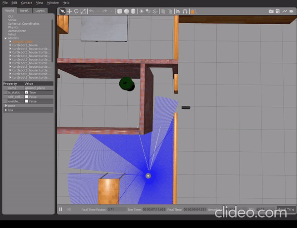
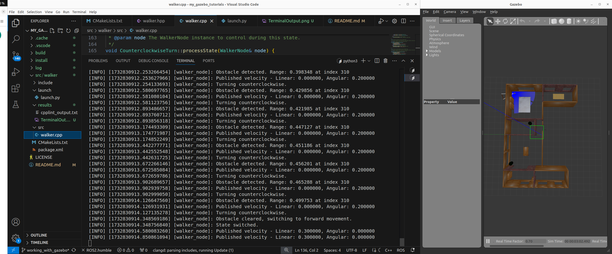

# Gazebo Tutorials
# My Gazebo Tutorials

## Overview

This repository contains the **walker** ROS 2 package, which demonstrates integration with Gazebo and the implementation of a walker behavior using the State Design Pattern. The walker behavior includes sensor data collection (LIDAR, depth camera), differential drive control, and rosbag recording for analysis.

## Assumptions/Dependencies

- **ROS 2 Humble**: This project was developed using ROS 2 Humble.
- **Gazebo 11**: Gazebo is used for simulating the robot in various environments.
- **Turtlebot3**: The simulation uses the Turtlebot3 model with depth camera and LIDAR sensors.
- **State Design Pattern**: The walker behavior is implemented using the State Design Pattern.

Before building and running the package, ensure you have the following ROS2 dependencies installed:

- **rclcpp**: ROS Client Library for C++.
- **sensor_msgs**: Standard messages for sensor data such as images, laser scans, and more.
- **geometry_msgs**: Messages for geometric data such as poses, vectors, and transforms.
- **nav_msgs**: Messages for navigation data, including odometry and map information.
- **tf2_ros**: ROS2 transformation library for handling coordinate frames.

These dependencies are required to properly compile and execute the walker node.


## Build Steps

```bash
# 1. Ensure that you have sourced your ROS 2 environment
# This step sets up your ROS 2 environment for usage
source /opt/ros/humble/setup.bash

# 2. Create your ROS 2 workspace
# The workspace will be where the package and dependencies are stored
mkdir -p ~/ros2_ws

# 3. Navigate to the workspace directory
# Change to the directory where you will work on the package
cd ~/ros2_ws

# 4. Clone the repository
# Clone the desired branch of the repository to your workspace
git clone https://github.com/nazringr/my_gazebo_tutorials.git 

# 5. Install rosdep dependencies before building the package
# rosdep installs the necessary dependencies for the package
rosdep install -i --from-path src --rosdistro humble -y

# 6. Build the package using colcon
# This will build the package, including setting up the compile commands for IDEs
colcon build --cmake-args -DCMAKE_EXPORT_COMPILE_COMMANDS=ON

# 7. Source the workspace to set up the environment variables
# This step ensures that the workspace is correctly sourced and ready to use
source install/setup.bash
```

## Run Steps

The publisher will publish messages to the topic, and the subscriber will listen and display those messages.

```bash
#1. In Terminal 1, Launch Gazebo world 
ros2 launch turtlebot3_gazebo turtlebot3_house.launch.py x_pose:=-2.0 y_pose:=1.0 z_pose:=0.0

#2. In Terminal 2, Run Launch file
ros2 launch walker launch.py record_bag:=True stop:=True

   
## Linting and Code Quality
```bash
To run cpplint on the source files:
    `cpplint src/walker/src/*.cpp > cpplint_output.txt`

To run clang-tidy on the source files:
    `clang-tidy -p build/walker --extra-arg=-std=c++17 src/walker/src/walker.cpp > src/walker/results/clang-tidy.txt`
```

## Results

Here is the walker robot in action inside the Gazebo simulation. The robot moves in the environment, collects sensor data, and performs control.



Terminal output: (behavior is defined by the **State Design Pattern** in the walker node)




## License

This project is licensed under the **Apache License 2.0** - see the [LICENSE](LICENSE) file for details.

